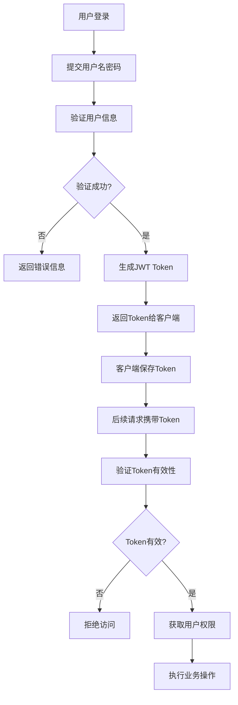

# 中小型超市数字化管理系统 (Supermarket Management System)

## 📖 项目简介
本项目是一个面向中小型超市的数字化管理平台，旨在解决传统超市在库存管理、会员营销、数据决策等方面的痛点。系统采用当前主流的 **前后端分离** 架构，后端使用Spring Boot + Spring Security + MyBatis-Plus，前端使用Vue.js + Element UI，实现现代化的超市管理解决方案。

## 🛠 技术栈
- **后端**: Spring Boot, Spring Security, MyBatis-Plus, JWT
- **前端**: Vue.js, Element UI, ECharts, Axios
- **数据库**: MySQL 8.0
- **依赖管理**: Maven
- **认证方式**: JWT无状态认证

## 📂 目录结构
```
Supermarket-System/
├── supermarket-backend/          # 后端 Java 源码
│   ├── src/main/java/com/supermarket/
│   │   ├── auth/                 # 认证模块
│   │   ├── common/               # 通用工具类
│   │   ├── config/               # 配置类
│   │   ├── user/                 # 用户模块
│   │   └── product/              # 商品模块
│   └── src/main/resources/
├── supermarket-frontend/         # 前端 Vue 源码
├── supermarket-database/         # 数据库 SQL 脚本
│   └── sql/
├── supermarket-docs/             # 设计文档与任务清单
│   ├── API_DOC.md               # API接口文档
│   └── TASK_LIST.md             # 任务清单
└── README.md
```

## 🚀 快速启动 (后端)

### 1. 环境准备
确保已安装以下环境：
- JDK 1.8+
- Maven 3.6+
- MySQL 8.0+

### 2. 数据库初始化
1. 创建数据库并执行SQL脚本：
   ```sql
   # 执行以下脚本初始化数据库表结构
   supermarket-database/sql/01_user_role.sql
   supermarket-database/sql/02_product.sql
   ```

### 3. 项目配置
1. 修改 [application.yml](supermarket-backend/src/main/resources/application.yml) 中的数据库连接信息：
   ```yaml
   spring:
     datasource:
       url: jdbc:mysql://localhost:3306/supermarket_db?useUnicode=true&characterEncoding=utf-8&useSSL=false&serverTimezone=Asia/Shanghai
       username: root              # 修改为你的MySQL用户名
       password: password          # 修改为你的MySQL密码
   ```

### 4. 启动项目
1. 在项目根目录执行Maven命令：
   ```bash
   cd supermarket-backend
   mvn clean install
   ```
2. 运行 [SupermarketApplication.java](supermarket-backend/src/main/java/com/supermarket/SupermarketApplication.java) 启动后端服务
3. 后端服务默认启动在 `http://localhost:8080`

## 🔐 认证与授权机制

### JWT认证流程
本项目采用JWT（JSON Web Token）进行无状态认证，具体流程如下：



### 权限控制
- 采用RBAC（基于角色的访问控制）模型
- 用户-角色-权限三级关联关系
- 通过Spring Security实现细粒度权限控制

## 📡 API接口说明

### 认证相关接口
- **登录**: `POST /auth/login` - 用户登录获取Token
- **获取用户信息**: `GET /auth/info` - 获取当前登录用户信息
- **退出**: `POST /auth/logout` - 用户退出

### 用户管理接口
- **分页查询**: `GET /user/page` - 分页获取用户列表
- **新增用户**: `POST /user` - 创建新用户
- **修改用户**: `PUT /user` - 更新用户信息
- **删除用户**: `DELETE /user/{id}` - 删除指定用户
- **批量删除**: `DELETE /user/batch` - 批量删除用户
- **获取详情**: `GET /user/{id}` - 获取用户详细信息

### 商品管理接口
- **分页查询**: `GET /api/product/page` - 分页获取商品列表
- **新增商品**: `POST /api/product` - 创建新商品
- **修改商品**: `PUT /api/product` - 更新商品信息
- **删除商品**: `DELETE /api/product/{id}` - 删除指定商品
- **修改状态**: `PUT /api/product/{id}/status/{status}` - 修改商品上下架状态
- **条码查询**: `GET /api/product/barcode/{barcode}` - 根据条码查询商品

### 商品分类管理接口
- **获取分类树**: `GET /product/category/tree` - 获取分类树形结构
- **新增分类**: `POST /product/category` - 创建新分类
- **修改分类**: `PUT /product/category` - 更新分类信息
- **删除分类**: `DELETE /product/category/{id}` - 删除指定分类

### 认证方式
所有需要认证的接口都需要在请求头中携带：
```
Authorization: Bearer <your_token_here>
```

完整的API接口文档请参见：[API_DOC.md](supermarket-docs/API_DOC.md)

## 📋 项目开发进度

根据[TASK_LIST.md](supermarket-docs/TASK_LIST.md)的记录，当前已完成的功能包括：

### 已完成模块
- ✅ 基础架构与环境搭建
  - 项目文档初始化
  - 后端依赖构建与SpringBoot工程初始化
  - 数据库设计：用户/角色/权限表结构
  - 前后端分离跨域配置
  - 统一返回结果封装与全局异常处理

- ✅ 用户与权限模块 (Security + JWT)
  - 数据库建表：用户表、角色表、权限表
  - JWT工具类封装（生成/解析Token）
  - Spring Security认证过滤器链配置
  - 登录接口实现（返回Token）
  - 用户增删改查API
  - 获取当前登录用户信息API

- ✅ 商品管理模块
  - 数据库建表：商品表、商品分类表
  - 商品基础增删改查API
  - 商品分页查询API（支持多条件筛选）
  - 商品唯一性校验（条形码唯一性）
  - 商品分类树形结构API
  - 安全删除分类（带校验逻辑）

### 待开发模块
- 📦 进货管理模块
- 📦 库存管理模块
- 📦 会员与营销模块
- 📦 报表与数据可视化

## 🛠 开发指南

### 代码结构说明
1. **controller层**: 处理HTTP请求，参数校验和返回结果封装
2. **service层**: 业务逻辑处理，事务管理
3. **mapper层**: 数据库访问接口
4. **entity层**: 数据库实体类
5. **dto层**: 数据传输对象
6. **config层**: 项目配置类
7. **common层**: 通用工具类和异常处理

### 安全特性
- 使用BCrypt加密存储用户密码
- JWT Token有效期管理
- 基于角色的权限控制
- 统一异常处理机制
- SQL注入防护（MyBatis-Plus）
- 商品条码唯一性校验

### 商品管理模块特点
- **商品分类**: 支持多级分类管理，提供树形结构API
- **商品信息**: 包含条码、名称、规格、价格、库存等完整信息
- **库存管理**: 支持库存数量和预警阈值设置
- **状态管理**: 支持商品上下架状态切换
- **条码查询**: 支持通过条码快速查询商品，适用于收银台扫码场景

## 🤝 贡献指南
欢迎提交Issue和Pull Request来帮助改进项目。

## 📄 许可证
本项目仅供学习交流使用。