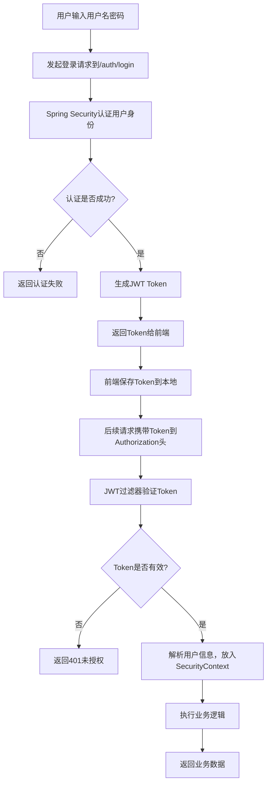

# 🔌 API 接口文档

## 1. 通用说明

### 1.1 基础路径
所有接口的基础路径为：`http://localhost:8080/api`

### 1.2 数据交互格式
- 请求格式：`Content-Type: application/json`
- 响应格式：`Content-Type: application/json;charset=utf-8`

### 1.3 统一响应结构
所有接口均返回如下 JSON 结构：

```json
{
  "code": 200,
  "message": "操作成功",
  "data": { ... }
}
```

### 1.4 认证方式
登录成功后，后端会返回 `token`。后续请求需要在 Header 中携带：
`Authorization: Bearer <your_token_here>`

---

## 2. 接口列表 (持续更新)

### 2.1 认证模块 (Auth)

#### 用户登录
| 接口描述 | URL | 请求方式 | 参数 | 响应 |
| :--- | :--- | :--- | :--- | :--- |
| 用户登录 | `/auth/login` | POST | 见下方示例 | 见下方示例 |

**请求示例：**
```json
{
  "username": "admin",
  "password": "123456"
}
```

**响应示例：**
```json
{
  "code": 200,
  "message": "登录成功",
  "data": {
    "token": "eyJhbGciOiJIUzI1NiJ9..."
  }
}
```

#### 获取当前登录用户信息
| 接口描述 | URL | 请求方式 | 请求头 | 响应 |
| :--- | :--- | :--- | :--- | :--- |
| 获取当前登录用户信息 | `/auth/info` | GET | `Authorization: Bearer <token>` | 见下方示例 |

**响应示例：**
```json
{
  "code": 200,
  "message": "操作成功", 
  "data": {
    "id": 1,
    "username": "admin",
    "nickname": "超级管理员",
    "avatar": "https://cube.elemecdn.com/0/88/03b0d39583f48206768a7534e55bcpng.png",
    "roles": ["ROLE_ADMIN"],
    "perms": []
  }
}
```

#### 用户退出
| 接口描述 | URL | 请求方式 | 响应 |
| :--- | :--- | :--- | :--- |
| 用户退出 | `/auth/logout` | POST | 见下方示例 |

**响应示例：**
```json
{
  "code": 200,
  "message": "退出成功",
  "data": null
}
```

### 2.2 用户管理模块 (User)

#### 分页查询用户列表
| 接口描述 | URL | 请求方式 | 参数 | 响应 |
| :--- | :--- | :--- | :--- | :--- |
| 分页查询用户列表 | `/user/page` | GET | `pageNum=1&pageSize=10&username=` | 见下方示例 |

**请求示例：**
```
GET /user/page?pageNum=1&pageSize=10&username=admin
```

**响应示例：**
```json
{
  "code": 200,
  "message": "操作成功",
  "data": {
    "records": [
      {
        "id": 1,
        "username": "admin",
        "nickname": "超级管理员",
        "phone": null,
        "gender": 1,
        "status": 1,
        "createTime": "2026-01-09T10:30:00",
        "updateTime": "2026-01-09T10:30:00"
      }
    ],
    "total": 1,
    "size": 10,
    "current": 1,
    "pages": 1
  }
}
```

#### 新增用户
| 接口描述 | URL | 请求方式 | 请求头 | 参数 | 响应 |
| :--- | :--- | :--- | :--- | :--- | :--- |
| 新增用户 | `/user` | POST | `Authorization: Bearer <token>` | 见下方示例 | 见下方示例 |

**请求示例：**
```json
{
  "username": "testuser",
  "nickname": "测试用户",
  "phone": "13800138000",
  "gender": 1,
  "status": 1
}
```

**响应示例：**
```json
{
  "code": 200,
  "message": "操作成功",
  "data": true
}
```

#### 修改用户
| 接口描述 | URL | 请求方式 | 请求头 | 参数 | 响应 |
| :--- | :--- | :--- | :--- | :--- | :--- |
| 修改用户 | `/user` | PUT | `Authorization: Bearer <token>` | 见下方示例 | 见下方示例 |

**请求示例：**
```json
{
  "id": 1,
  "username": "admin",
  "nickname": "管理员",
  "phone": "13800138000",
  "gender": 1,
  "status": 1
}
```

**响应示例：**
```json
{
  "code": 200,
  "message": "操作成功",
  "data": true
}
```

#### 删除用户
| 接口描述 | URL | 请求方式 | 请求头 | 参数 | 响应 |
| :--- | :--- | :--- | :--- | :--- | :--- |
| 删除用户 | `/user/{id}` | DELETE | `Authorization: Bearer <token>` | `id` (路径参数) | 见下方示例 |

**请求示例：**
```
DELETE /user/1
```

**响应示例：**
```json
{
  "code": 200,
  "message": "操作成功",
  "data": true
}
```

#### 批量删除用户
| 接口描述 | URL | 请求方式 | 请求头 | 参数 | 响应 |
| :--- | :--- | :--- | :--- | :--- | :--- |
| 批量删除用户 | `/user/batch` | DELETE | `Authorization: Bearer <token>` | `[1, 2, 3]` (请求体) | 见下方示例 |

**请求示例：**
```json
[1, 2, 3]
```

**响应示例：**
```json
{
  "code": 200,
  "message": "操作成功",
  "data": true
}
```

#### 根据ID获取用户详情
| 接口描述 | URL | 请求方式 | 请求头 | 参数 | 响应 |
| :--- | :--- | :--- | :--- | :--- | :--- |
| 根据ID获取用户详情 | `/user/{id}` | GET | `Authorization: Bearer <token>` | `id` (路径参数) | 见下方示例 |

**响应示例：**
```json
{
  "code": 200,
  "message": "操作成功",
  "data": {
    "id": 1,
    "username": "admin",
    "nickname": "超级管理员",
    "phone": null,
    "gender": 1,
    "status": 1,
    "createTime": "2026-01-09T10:30:00",
    "updateTime": "2026-01-09T10:30:00"
  }
}
```

### 2.3 商品管理模块 (Product)

#### 分页查询商品列表
| 接口描述 | URL | 请求方式 | 请求头 | 参数 | 响应 |
| :--- | :--- | :--- | :--- | :--- | :--- |
| 分页查询商品列表 | `/api/product/page` | GET | `Authorization: Bearer <token>` | `pageNum=1&pageSize=10&name=&categoryId=&status=` | 见下方示例 |

**请求示例：**
```
GET /api/product/page?pageNum=1&pageSize=10&name=可乐&categoryId=1&status=1
```

**响应示例：**
```json
{
  "code": 200,
  "message": "操作成功",
  "data": {
    "records": [
      {
        "id": 1,
        "categoryId": 1,
        "barcode": "6901234567890",
        "name": "可口可乐",
        "spec": "500ml",
        "unit": "瓶",
        "price": 3.50,
        "costPrice": 2.80,
        "stock": 100,
        "lowStockThreshold": 10,
        "status": 1,
        "remark": "碳酸饮料",
        "latestProductionDate": "2025-12-01",
        "shelfLifeDays": 365,
        "earliestExpirationDate": "2026-11-30",
        "createTime": "2026-01-09T10:30:00",
        "updateTime": "2026-01-09T10:30:00"
      }
    ],
    "total": 1,
    "size": 10,
    "current": 1,
    "pages": 1
  }
}
```

#### 新增商品
| 接口描述 | URL | 请求方式 | 请求头 | 参数 | 响应 |
| :--- | :--- | :--- | :--- | :--- | :--- |
| 新增商品 | `/api/product` | POST | `Authorization: Bearer <token>` | 见下方示例 | 见下方示例 |

**请求示例：**
```json
{
  "categoryId": 1,
  "barcode": "6901234567890",
  "name": "可口可乐",
  "spec": "500ml",
  "unit": "瓶",
  "price": 3.50,
  "costPrice": 2.80,
  "stock": 100,
  "lowStockThreshold": 10,
  "status": 1,
  "remark": "碳酸饮料",
  "latestProductionDate": "2025-12-01",
  "shelfLifeDays": 365
}
```

**响应示例：**
```json
{
  "code": 200,
  "message": "新增商品成功",
  "data": null
}
```

#### 修改商品
| 接口描述 | URL | 请求方式 | 请求头 | 参数 | 响应 |
| :--- | :--- | :--- | :--- | :--- | :--- |
| 修改商品 | `/api/product` | PUT | `Authorization: Bearer <token>` | 见下方示例 | 见下方示例 |

**请求示例：**
```json
{
  "id": 1,
  "categoryId": 1,
  "barcode": "6901234567890",
  "name": "可口可乐",
  "spec": "500ml",
  "unit": "瓶",
  "price": 3.60,
  "costPrice": 2.80,
  "stock": 100,
  "lowStockThreshold": 10,
  "status": 1,
  "remark": "碳酸饮料",
  "latestProductionDate": "2025-12-01",
  "shelfLifeDays": 365
}
```

**响应示例：**
```json
{
  "code": 200,
  "message": "修改商品成功",
  "data": null
}
```

#### 修改商品状态(上架/下架)
| 接口描述 | URL | 请求方式 | 请求头 | 参数 | 响应 |
| :--- | :--- | :--- | :--- | :--- | :--- |
| 修改商品状态 | `/api/product/{id}/status/{status}` | PUT | `Authorization: Bearer <token>` | `id` (路径参数), `status` (路径参数) | 见下方示例 |

**请求示例：**
```
PUT /api/product/1/status/0
```

**响应示例：**
```json
{
  "code": 200,
  "message": "状态更新成功",
  "data": null
}
```

#### 删除商品
| 接口描述 | URL | 请求方式 | 请求头 | 参数 | 响应 |
| :--- | :--- | :--- | :--- | :--- | :--- |
| 删除商品 | `/api/product/{id}` | DELETE | `Authorization: Bearer <token>` | `id` (路径参数) | 见下方示例 |

**请求示例：**
```
DELETE /api/product/1
```

**响应示例：**
```json
{
  "code": 200,
  "message": "删除成功",
  "data": null
}
```

#### 根据条码查询商品
| 接口描述 | URL | 请求方式 | 请求头 | 参数 | 响应 |
| :--- | :--- | :--- | :--- | :--- | :--- |
| 根据条码查询商品 | `/api/product/barcode/{barcode}` | GET | `Authorization: Bearer <token>` | `barcode` (路径参数) | 见下方示例 |

**请求示例：**
```
GET /api/product/barcode/6901234567890
```

**响应示例：**
```json
{
  "code": 200,
  "message": "操作成功",
  "data": {
    "id": 1,
    "categoryId": 1,
    "barcode": "6901234567890",
    "name": "可口可乐",
    "spec": "500ml",
    "unit": "瓶",
    "price": 3.50,
    "costPrice": 2.80,
    "stock": 100,
    "lowStockThreshold": 10,
    "status": 1,
    "remark": "碳酸饮料",
    "latestProductionDate": "2025-12-01",
    "shelfLifeDays": 365,
    "earliestExpirationDate": "2026-11-30",
    "createTime": "2026-01-09T10:30:00",
    "updateTime": "2026-01-09T10:30:00"
  }
}
```

#### 获取即将过期的商品列表
| 接口描述 | URL | 请求方式 | 请求头 | 参数 | 响应 |
| :--- | :--- | :--- | :--- | :--- | :--- |
| 获取即将过期的商品列表 | `/api/product/expiring-soon` | GET | `Authorization: Bearer <token>` | `days=7` (临期天数) | 见下方示例 |

**请求示例：**
```
GET /api/product/expiring-soon?days=7
```

**响应示例：**
```json
{
  "code": 200,
  "message": "操作成功",
  "data": [
    {
      "id": 1,
      "categoryId": 1,
      "barcode": "6901234567890",
      "name": "牛奶",
      "spec": "1L",
      "unit": "盒",
      "price": 12.00,
      "costPrice": 8.00,
      "stock": 50,
      "lowStockThreshold": 10,
      "status": 1,
      "remark": "鲜奶",
      "latestProductionDate": "2026-01-01",
      "shelfLifeDays": 7,
      "earliestExpirationDate": "2026-01-08",
      "createTime": "2026-01-01T10:30:00",
      "updateTime": "2026-01-01T10:30:00"
    }
  ]
}
```

#### 获取已过期的商品列表
| 接口描述 | URL | 请求方式 | 请求头 | 参数 | 响应 |
| :--- | :--- | :--- | :--- | :--- | :--- |
| 获取已过期的商品列表 | `/api/product/expired` | GET | `Authorization: Bearer <token>` | 无 | 见下方示例 |

**响应示例：**
```json
{
  "code": 200,
  "message": "操作成功",
  "data": [
    {
      "id": 1,
      "categoryId": 1,
      "barcode": "6901234567890",
      "name": "面包",
      "spec": "400g",
      "unit": "袋",
      "price": 8.00,
      "costPrice": 5.00,
      "stock": 5,
      "lowStockThreshold": 10,
      "status": 1,
      "remark": "全麦面包",
      "latestProductionDate": "2025-12-25",
      "shelfLifeDays": 5,
      "earliestExpirationDate": "2025-12-30",
      "createTime": "2025-12-25T10:30:00",
      "updateTime": "2025-12-25T10:30:00"
    }
  ]
}
```

### 2.4 商品分类管理模块 (Category)

#### 获取分类树形结构
| 接口描述 | URL | 请求方式 | 请求头 | 参数 | 响应 |
| :--- | :--- | :--- | :--- | :--- | :--- |
| 获取分类树形结构 | `/product/category/tree` | GET | `Authorization: Bearer <token>` | 无 | 见下方示例 |

**响应示例：**
```json
{
  "code": 200,
  "message": "操作成功",
  "data": [
    {
      "id": 1,
      "parentId": 0,
      "name": "饮料",
      "sort": 0,
      "status": 1,
      "children": [
        {
          "id": 2,
          "parentId": 1,
          "name": "碳酸饮料",
          "sort": 0,
          "status": 1,
          "children": []
        }
      ]
    },
    {
      "id": 3,
      "parentId": 0,
      "name": "零食",
      "sort": 0,
      "status": 1,
      "children": []
    }
  ]
}
```

#### 新增分类
| 接口描述 | URL | 请求方式 | 请求头 | 参数 | 响应 |
| :--- | :--- | :--- | :--- | :--- | :--- |
| 新增分类 | `/product/category` | POST | `Authorization: Bearer <token>` | 见下方示例 | 见下方示例 |

**请求示例：**
```json
{
  "parentId": 0,
  "name": "饮料",
  "sort": 0,
  "status": 1
}
```

**响应示例：**
```json
{
  "code": 200,
  "message": "操作成功",
  "data": true
}
```

#### 修改分类
| 接口描述 | URL | 请求方式 | 请求头 | 参数 | 响应 |
| :--- | :--- | :--- | :--- | :--- | :--- |
| 修改分类 | `/product/category` | PUT | `Authorization: Bearer <token>` | 见下方示例 | 见下方示例 |

**请求示例：**
```json
{
  "id": 1,
  "parentId": 0,
  "name": "饮料类",
  "sort": 0,
  "status": 1
}
```

**响应示例：**
```json
{
  "code": 200,
  "message": "操作成功",
  "data": true
}
```

#### 删除分类
| 接口描述 | URL | 请求方式 | 请求头 | 参数 | 响应 |
| :--- | :--- | :--- | :--- | :--- | :--- |
| 删除分类 | `/product/category/{id}` | DELETE | `Authorization: Bearer <token>` | `id` (路径参数) | 见下方示例 |

**请求示例：**
```
DELETE /product/category/1
```

**响应示例：**
```json
{
  "code": 200,
  "message": "操作成功",
  "data": true
}
```

### 2.5 库存管理模块 (Inventory)

#### 获取库存预警商品列表
| 接口描述 | URL | 请求方式 | 请求头 | 参数 | 响应 |
| :--- | :--- | :--- | :--- | :--- | :--- |
| 获取库存预警商品列表 | `/inventory/low-stock` | GET | `Authorization: Bearer <token>` | 无 | 见下方示例 |

**响应示例：**
```json
{
  "code": 200,
  "message": "操作成功",
  "data": [
    {
      "id": 1,
      "categoryId": 1,
      "barcode": "6901234567890",
      "name": "可口可乐",
      "spec": "500ml",
      "unit": "瓶",
      "price": 3.50,
      "costPrice": 2.80,
      "stock": 5,
      "lowStockThreshold": 10,
      "status": 1,
      "remark": "碳酸饮料",
      "latestProductionDate": "2025-12-01",
      "shelfLifeDays": 365,
      "earliestExpirationDate": "2026-11-30",
      "createTime": "2026-01-09T10:30:00",
      "updateTime": "2026-01-09T10:30:00"
    }
  ]
}
```

#### 检查单个商品是否库存不足
| 接口描述 | URL | 请求方式 | 请求头 | 参数 | 响应 |
| :--- | :--- | :--- | :--- | :--- | :--- |
| 检查单个商品是否库存不足 | `/inventory/check-low-stock/{id}` | GET | `Authorization: Bearer <token>` | `id` (路径参数) | 见下方示例 |

**请求示例：**
```
GET /inventory/check-low-stock/1
```

**响应示例：**
```json
{
  "code": 200,
  "message": "操作成功",
  "data": true
}
```

#### 获取库存详情
| 接口描述 | URL | 请求方式 | 请求头 | 参数 | 响应 |
| :--- | :--- | :--- | :--- | :--- | :--- |
| 获取库存详情 | `/inventory/detail/{id}` | GET | `Authorization: Bearer <token>` | `id` (路径参数) | 见下方示例 |

**请求示例：**
```
GET /inventory/detail/1
```

**响应示例：**
```json
{
  "code": 200,
  "message": "操作成功",
  "data": {
    "id": 1,
    "categoryId": 1,
    "barcode": "6901234567890",
    "name": "可口可乐",
    "spec": "500ml",
    "unit": "瓶",
    "price": 3.50,
    "costPrice": 2.80,
    "stock": 100,
    "lowStockThreshold": 10,
    "status": 1,
    "remark": "碳酸饮料",
    "latestProductionDate": "2025-12-01",
    "shelfLifeDays": 365,
    "earliestExpirationDate": "2026-11-30",
    "createTime": "2026-01-09T10:30:00",
    "updateTime": "2026-01-09T10:30:00"
  }
}
```

### 2.6 库存盘点模块 (Inventory Count)

#### 分页查询盘点列表
| 接口描述 | URL | 请求方式 | 请求头 | 参数 | 响应 |
| :--- | :--- | :--- | :--- | :--- | :--- |
| 分页查询盘点列表 | `/inventory/count/page` | GET | `Authorization: Bearer <token>` | `pageNum=1&pageSize=10&title=盘点任务&status=DRAFT` | 见下方示例 |

**请求示例：**
```
GET /inventory/count/page?pageNum=1&pageSize=10&title=盘点任务&status=DRAFT
```

**响应示例：**
```json
{
  "code": 200,
  "message": "操作成功",
  "data": {
    "records": [
      {
        "id": 1,
        "countNumber": "PC202601130001",
        "title": "第一季度盘点",
        "description": "第一季度商品库存盘点",
        "totalCount": 100,
        "discrepancyCount": 5,
        "status": "IN_PROGRESS",
        "startTime": "2026-01-13T10:00:00",
        "endTime": null,
        "operatorId": 1,
        "operatorName": "管理员",
        "createTime": "2026-01-13T09:00:00",
        "updateTime": "2026-01-13T10:00:00"
      }
    ],
    "total": 1,
    "size": 10,
    "current": 1,
    "pages": 1
  }
}
```

#### 创建盘点任务
| 接口描述 | URL | 请求方式 | 请求头 | 参数 | 响应 |
| :--- | :--- | :--- | :--- | :--- | :--- |
| 创建盘点任务 | `/inventory/count` | POST | `Authorization: Bearer <token>` | 见下方示例 | 见下方示例 |

**请求示例：**
```json
{
  "title": "第一季度盘点",
  "description": "第一季度商品库存盘点",
  "operatorId": 1,
  "operatorName": "管理员",
  "remark": "重要盘点任务"
}
```

**响应示例：**
```json
{
  "code": 200,
  "message": "操作成功",
  "data": 1
}
```

#### 开始盘点
| 接口描述 | URL | 请求方式 | 请求头 | 参数 | 响应 |
| :--- | :--- | :--- | :--- | :--- | :--- |
| 开始盘点 | `/inventory/count/{id}/start` | PUT | `Authorization: Bearer <token>` | `id` (路径参数) | 见下方示例 |

**请求示例：**
```
PUT /inventory/count/1/start
```

**响应示例：**
```json
{
  "code": 200,
  "message": "开始盘点成功",
  "data": null
}
```

#### 完成盘点
| 接口描述 | URL | 请求方式 | 请求头 | 参数 | 响应 |
| :--- | :--- | :--- | :--- | :--- | :--- |
| 完成盘点 | `/inventory/count/{id}/complete` | PUT | `Authorization: Bearer <token>` | `id` (路径参数) | 见下方示例 |

**请求示例：**
```
PUT /inventory/count/1/complete
```

**响应示例：**
```json
{
  "code": 200,
  "message": "完成盘点成功",
  "data": null
}
```

#### 获取盘点详情列表
| 接口描述 | URL | 请求方式 | 请求头 | 参数 | 响应 |
| :--- | :--- | :--- | :--- | :--- | :--- |
| 获取盘点详情列表 | `/inventory/count/{id}/details` | GET | `Authorization: Bearer <token>` | `id` (路径参数) | 见下方示例 |

**请求示例：**
```
GET /inventory/count/1/details
```

**响应示例：**
```json
{
  "code": 200,
  "message": "操作成功",
  "data": [
    {
      "id": 1,
      "countId": 1,
      "productId": 1,
      "productName": "可口可乐",
      "productBarcode": "6901234567890",
      "productSpec": "500ml",
      "productUnit": "瓶",
      "systemStock": 100,
      "actualStock": 95,
      "difference": -5,
      "status": "DISCREPANCY",
      "discrepancyReason": "销售未及时录入",
      "remark": "需关注",
      "createTime": "2026-01-13T10:30:00",
      "updateTime": "2026-01-13T10:30:00"
    }
  ]
}
```

#### 添加盘点详情
| 接口描述 | URL | 请求方式 | 请求头 | 参数 | 响应 |
| :--- | :--- | :--- | :--- | :--- | :--- |
| 添加盘点详情 | `/inventory/count/{countId}/detail` | POST | `Authorization: Bearer <token>` | `countId` (路径参数), 请求体见下方示例 | 见下方示例 |

**请求示例：**
```json
{
  "productId": 1,
  "productName": "可口可乐",
  "productBarcode": "6901234567890",
  "productSpec": "500ml",
  "productUnit": "瓶",
  "systemStock": 100,
  "actualStock": 95,
  "discrepancyReason": "销售未及时录入",
  "remark": "需关注"
}
```

**响应示例：**
```json
{
  "code": 200,
  "message": "添加盘点详情成功",
  "data": null
}
```

---

## 3. 系统状态码说明

| 状态码 | 含义 | 说明 |
| :--- | :--- | :--- |
| 200 | SUCCESS | 操作成功 |
| 400 | PARAM_ERROR | 参数错误 |
| 401 | unauthorized | 暂未登录或Token已失效 |
| 403 | FORBIDDEN | 没有权限进行此操作 |
| 500 | ERROR | 系统内部异常 |
| 2001 | USER_EXIST | 用户已存在 |
| 2002 | USER_NOT_LOGIN | 用户不存在或密码错误 |

---

## 4. 认证流程详解

### 4.1 JWT认证流程图



### 4.2 认证流程说明

1. **用户登录认证**：
   - 用户向 [/auth/login](#用户登录) 接口提交用户名和密码
   - Spring Security 通过 `UserDetailsServiceImpl` 验证用户信息
   - 验证成功后生成 JWT Token 并返回给前端

2. **JWT Token 验证**：
   - 前端在后续请求中将 Token 放入 `Authorization` 请求头
   - `JwtAuthenticationFilter` 过滤器拦截请求并验证 Token
   - 验证通过后将用户信息放入 Spring Security 上下文

3. **权限控制**：
   - 通过 Spring Security 配置控制接口访问权限
   - 未登录用户只能访问白名单接口（如登录接口）

> *注：更多接口将在开发过程中逐步补充...*