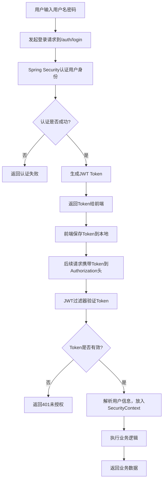

# 🔌 API 接口文档

## 1. 通用说明

### 1.1 基础路径
所有接口的基础路径为：`http://localhost:8080/api`

### 1.2 数据交互格式
- 请求格式：`Content-Type: application/json`
- 响应格式：`Content-Type: application/json;charset=utf-8`

### 1.3 统一响应结构
所有接口均返回如下 JSON 结构：

```json
{
  "code": 200,
  "message": "操作成功",
  "data": { ... }
}
```

### 1.4 认证方式
登录成功后，后端会返回 `token`。后续请求需要在 Header 中携带：
`Authorization: Bearer <your_token_here>`

### 1.5 员工管理语义说明
当前系统已将“用户管理”业务语义升级为“员工管理”。为保持 Spring Security、JWT 与角色权限链路稳定，底层表结构、实体命名及部分接口路径仍沿用 `sys_user` / `/user` 命名。

---

## 2. 接口列表 (持续更新)

### 2.1 认证模块 (Auth)

#### 用户登录
| 接口描述 | URL | 请求方式 | 参数 | 响应 |
| :--- | :--- | :--- | :--- | :--- |
| 用户登录 | `/auth/login` | POST | 见下方示例 | 见下方示例 |

**请求示例：**
```json
{
  "username": "admin",
  "password": "123456"
}
```

**响应示例：**
```json
{
  "code": 200,
  "message": "登录成功",
  "data": {
    "token": "eyJhbGciOiJIUzI1NiJ9..."
  }
}
```

#### 获取当前登录用户信息
| 接口描述 | URL | 请求方式 | 请求头 | 响应 |
| :--- | :--- | :--- | :--- | :--- |
| 获取当前登录用户信息 | `/auth/info` | GET | `Authorization: Bearer <token>` | 见下方示例 |

**响应示例：**
```json
{
  "code": 200,
  "message": "操作成功", 
  "data": {
    "id": 1,
    "username": "admin",
    "nickname": "超级管理员",
    "avatar": "https://cube.elemecdn.com/0/88/03b0d39583f48206768a7534e55bcpng.png",
    "roles": ["ROLE_ADMIN"],
    "perms": []
  }
}
```

#### 用户退出
| 接口描述 | URL | 请求方式 | 响应 |
| :--- | :--- | :--- | :--- |
| 用户退出 | `/auth/logout` | POST | 见下方示例 |

**响应示例：**
```json
{
  "code": 200,
  "message": "退出成功",
  "data": null
}
```

#### 修改密码
| 接口描述 | URL | 请求方式 | 参数 | 响应 |
| :--- | :--- | :--- | :--- | :--- |
| 修改密码 | `/auth/password` | POST | `Authorization: Bearer <token>` | 见下方示例 |

**请求示例：**
```json
{
  "oldPassword": "old",
  "newPassword": "new"
}
```

**响应示例：**
```json
{
  "code": 200,
  "message": "密码修改成功",
  "data": null
}
```

### 2.2 员工管理模块 (Employee)

> 说明：当前后端仍沿用 `/user` 路径，以兼容现有认证与权限链路。

#### 分页查询员工列表
| 接口描述 | URL | 请求方式 | 参数 | 响应 |
| :--- | :--- | :--- | :--- | :--- |
| 分页查询员工列表 | `/user/page` | GET | `pageNum=1&pageSize=10&username=&keyword=` | 见下方示例 |

**请求示例：**
```
GET /user/page?pageNum=1&pageSize=10&username=admin&keyword=EMP0001
```

**响应示例：**
```json
{
  "code": 200,
  "message": "操作成功",
  "data": {
    "records": [
      {
        "id": 1,
        "username": "admin",
        "nickname": "超级管理员",
        "realName": "系统管理员",
        "employeeNo": "EMP0001",
        "jobTitle": "管理员",
        "hireDate": "2026-01-09T10:30:00",
        "phone": null,
        "gender": 1,
        "status": 1,
        "remark": "初始管理员账号",
        "createTime": "2026-01-09T10:30:00",
        "updateTime": "2026-01-09T10:30:00"
      }
    ],
    "total": 1,
    "size": 10,
    "current": 1,
    "pages": 1
  }
}
```

#### 新增员工
| 接口描述 | URL | 请求方式 | 请求头 | 参数 | 响应 |
| :--- | :--- | :--- | :--- | :--- | :--- |
| 新增员工 | `/user` | POST | `Authorization: Bearer <token>` | 见下方示例 | 见下方示例 |

**请求示例：**
```json
{
  "username": "cashier01",
  "realName": "张三",
  "nickname": "张三",
  "employeeNo": "EMP0002",
  "jobTitle": "收银员",
  "hireDate": "2026-03-01 09:00:00",
  "phone": "13800138000",
  "gender": 1,
  "status": 1,
  "remark": "门店收银岗",
  "roleIds": [3]
}
```

**响应示例：**
```json
{
  "code": 200,
  "message": "操作成功",
  "data": true
}
```

#### 修改员工
| 接口描述 | URL | 请求方式 | 请求头 | 参数 | 响应 |
| :--- | :--- | :--- | :--- | :--- | :--- |
| 修改员工 | `/user` | PUT | `Authorization: Bearer <token>` | 见下方示例 | 见下方示例 |

**请求示例：**
```json
{
  "id": 1,
  "username": "admin",
  "realName": "系统管理员",
  "nickname": "系统管理员",
  "employeeNo": "EMP0001",
  "jobTitle": "管理员",
  "hireDate": "2026-01-09 10:30:00",
  "phone": "13800138000",
  "gender": 1,
  "status": 1,
  "remark": "系统维护负责人",
  "roleIds": [1]
}
```

**响应示例：**
```json
{
  "code": 200,
  "message": "操作成功",
  "data": true
}
```

#### 删除员工
| 接口描述 | URL | 请求方式 | 请求头 | 参数 | 响应 |
| :--- | :--- | :--- | :--- | :--- | :--- |
| 删除员工 | `/user/{id}` | DELETE | `Authorization: Bearer <token>` | `id` (路径参数) | 见下方示例 |

**请求示例：**
```
DELETE /user/1
```

**响应示例：**
```json
{
  "code": 200,
  "message": "操作成功",
  "data": true
}
```

#### 批量删除员工
| 接口描述 | URL | 请求方式 | 请求头 | 参数 | 响应 |
| :--- | :--- | :--- | :--- | :--- | :--- |
| 批量删除员工 | `/user/batch` | DELETE | `Authorization: Bearer <token>` | `[1, 2, 3]` (请求体) | 见下方示例 |

**请求示例：**
```json
[1, 2, 3]
```

**响应示例：**
```json
{
  "code": 200,
  "message": "操作成功",
  "data": true
}
```

#### 根据ID获取员工详情
| 接口描述 | URL | 请求方式 | 请求头 | 参数 | 响应 |
| :--- | :--- | :--- | :--- | :--- | :--- |
| 根据ID获取员工详情 | `/user/{id}` | GET | `Authorization: Bearer <token>` | `id` (路径参数) | 见下方示例 |

**响应示例：**
```json
{
  "code": 200,
  "message": "操作成功",
  "data": {
    "id": 1,
    "username": "admin",
    "nickname": "超级管理员",
    "realName": "系统管理员",
    "employeeNo": "EMP0001",
    "jobTitle": "管理员",
    "hireDate": "2026-01-09T10:30:00",
    "phone": null,
    "gender": 1,
    "status": 1,
    "remark": "初始管理员账号",
    "createTime": "2026-01-09T10:30:00",
    "updateTime": "2026-01-09T10:30:00"
  }
}
```

### 2.3 商品管理模块 (Product)

#### 分页查询商品列表
| 接口描述 | URL | 请求方式 | 请求头 | 参数 | 响应 |
| :--- | :--- | :--- | :--- | :--- | :--- |
| 分页查询商品列表 | `/api/product/page` | GET | `Authorization: Bearer <token>` | `pageNum=1&pageSize=10&name=&categoryId=&status=` | 见下方示例 |

**请求示例：**
```
GET /api/product/page?pageNum=1&pageSize=10&name=可乐&categoryId=1&status=1
```

**响应示例：**
```json
{
  "code": 200,
  "message": "操作成功",
  "data": {
    "records": [
      {
        "id": 1,
        "categoryId": 1,
        "barcode": "6901234567890",
        "name": "可口可乐",
        "spec": "500ml",
        "unit": "瓶",
        "price": 3.50,
        "costPrice": 2.80,
        "stock": 100,
        "lowStockThreshold": 10,
        "status": 1,
        "remark": "碳酸饮料",
        "latestProductionDate": "2025-12-01",
        "shelfLifeDays": 365,
        "earliestExpirationDate": "2026-11-30",
        "createTime": "2026-01-09T10:30:00",
        "updateTime": "2026-01-09T10:30:00"
      }
    ],
    "total": 1,
    "size": 10,
    "current": 1,
    "pages": 1
  }
}
```

#### 新增商品
| 接口描述 | URL | 请求方式 | 请求头 | 参数 | 响应 |
| :--- | :--- | :--- | :--- | :--- | :--- |
| 新增商品 | `/api/product` | POST | `Authorization: Bearer <token>` | 见下方示例 | 见下方示例 |

**请求示例：**
```json
{
  "categoryId": 1,
  "barcode": "6901234567890",
  "name": "可口可乐",
  "spec": "500ml",
  "unit": "瓶",
  "price": 3.50,
  "costPrice": 2.80,
  "stock": 100,
  "lowStockThreshold": 10,
  "status": 1,
  "remark": "碳酸饮料",
  "latestProductionDate": "2025-12-01",
  "shelfLifeDays": 365
}
```

**响应示例：**
```json
{
  "code": 200,
  "message": "新增商品成功",
  "data": null
}
```

#### 修改商品
| 接口描述 | URL | 请求方式 | 请求头 | 参数 | 响应 |
| :--- | :--- | :--- | :--- | :--- | :--- |
| 修改商品 | `/api/product` | PUT | `Authorization: Bearer <token>` | 见下方示例 | 见下方示例 |

**请求示例：**
```json
{
  "id": 1,
  "categoryId": 1,
  "barcode": "6901234567890",
  "name": "可口可乐",
  "spec": "500ml",
  "unit": "瓶",
  "price": 3.60,
  "costPrice": 2.80,
  "stock": 100,
  "lowStockThreshold": 10,
  "status": 1,
  "remark": "碳酸饮料",
  "latestProductionDate": "2025-12-01",
  "shelfLifeDays": 365
}
```

**响应示例：**
```json
{
  "code": 200,
  "message": "修改商品成功",
  "data": null
}
```

#### 修改商品状态(上架/下架)
| 接口描述 | URL | 请求方式 | 请求头 | 参数 | 响应 |
| :--- | :--- | :--- | :--- | :--- | :--- |
| 修改商品状态 | `/api/product/{id}/status/{status}` | PUT | `Authorization: Bearer <token>` | `id` (路径参数), `status` (路径参数) | 见下方示例 |

**请求示例：**
```
PUT /api/product/1/status/0
```

**响应示例：**
```json
{
  "code": 200,
  "message": "状态更新成功",
  "data": null
}
```

#### 删除商品
| 接口描述 | URL | 请求方式 | 请求头 | 参数 | 响应 |
| :--- | :--- | :--- | :--- | :--- | :--- |
| 删除商品 | `/api/product/{id}` | DELETE | `Authorization: Bearer <token>` | `id` (路径参数) | 见下方示例 |

**请求示例：**
```
DELETE /api/product/1
```

**响应示例：**
```json
{
  "code": 200,
  "message": "删除成功",
  "data": null
}
```

#### 根据条码查询商品
| 接口描述 | URL | 请求方式 | 请求头 | 参数 | 响应 |
| :--- | :--- | :--- | :--- | :--- | :--- |
| 根据条码查询商品 | `/api/product/barcode/{barcode}` | GET | `Authorization: Bearer <token>` | `barcode` (路径参数) | 见下方示例 |

**请求示例：**
```
GET /api/product/barcode/6901234567890
```

**响应示例：**
```json
{
  "code": 200,
  "message": "操作成功",
  "data": {
    "id": 1,
    "categoryId": 1,
    "barcode": "6901234567890",
    "name": "可口可乐",
    "spec": "500ml",
    "unit": "瓶",
    "price": 3.50,
    "costPrice": 2.80,
    "stock": 100,
    "lowStockThreshold": 10,
    "status": 1,
    "remark": "碳酸饮料",
    "latestProductionDate": "2025-12-01",
    "shelfLifeDays": 365,
    "earliestExpirationDate": "2026-11-30",
    "createTime": "2026-01-09T10:30:00",
    "updateTime": "2026-01-09T10:30:00"
  }
}
```

#### 获取即将过期的商品列表
| 接口描述 | URL | 请求方式 | 请求头 | 参数 | 响应 |
| :--- | :--- | :--- | :--- | :--- | :--- |
| 获取即将过期的商品列表 | `/api/product/expiring-soon` | GET | `Authorization: Bearer <token>` | `days=7` (临期天数) | 见下方示例 |

**请求示例：**
```
GET /api/product/expiring-soon?days=7
```

**响应示例：**
```json
{
  "code": 200,
  "message": "操作成功",
  "data": [
    {
      "id": 1,
      "categoryId": 1,
      "barcode": "6901234567890",
      "name": "牛奶",
      "spec": "1L",
      "unit": "盒",
      "price": 12.00,
      "costPrice": 8.00,
      "stock": 50,
      "lowStockThreshold": 10,
      "status": 1,
      "remark": "鲜奶",
      "latestProductionDate": "2026-01-01",
      "shelfLifeDays": 7,
      "earliestExpirationDate": "2026-01-08",
      "createTime": "2026-01-01T10:30:00",
      "updateTime": "2026-01-01T10:30:00"
    }
  ]
}
```

#### 获取已过期的商品列表
| 接口描述 | URL | 请求方式 | 请求头 | 参数 | 响应 |
| :--- | :--- | :--- | :--- | :--- | :--- |
| 获取已过期的商品列表 | `/api/product/expired` | GET | `Authorization: Bearer <token>` | 无 | 见下方示例 |

**响应示例：**
```json
{
  "code": 200,
  "message": "操作成功",
  "data": [
    {
      "id": 1,
      "categoryId": 1,
      "barcode": "6901234567890",
      "name": "面包",
      "spec": "400g",
      "unit": "袋",
      "price": 8.00,
      "costPrice": 5.00,
      "stock": 5,
      "lowStockThreshold": 10,
      "status": 1,
      "remark": "全麦面包",
      "latestProductionDate": "2025-12-25",
      "shelfLifeDays": 5,
      "earliestExpirationDate": "2025-12-30",
      "createTime": "2025-12-25T10:30:00",
      "updateTime": "2025-12-25T10:30:00"
    }
  ]
}
```

### 2.4 商品分类管理模块 (Category)

#### 获取分类树形结构
| 接口描述 | URL | 请求方式 | 请求头 | 参数 | 响应 |
| :--- | :--- | :--- | :--- | :--- | :--- |
| 获取分类树形结构 | `/product/category/tree` | GET | `Authorization: Bearer <token>` | 无 | 见下方示例 |

**响应示例：**
```json
{
  "code": 200,
  "message": "操作成功",
  "data": [
    {
      "id": 1,
      "parentId": 0,
      "name": "饮料",
      "sort": 0,
      "status": 1,
      "children": [
        {
          "id": 2,
          "parentId": 1,
          "name": "碳酸饮料",
          "sort": 0,
          "status": 1,
          "children": []
        }
      ]
    },
    {
      "id": 3,
      "parentId": 0,
      "name": "零食",
      "sort": 0,
      "status": 1,
      "children": []
    }
  ]
}
```

#### 新增分类
| 接口描述 | URL | 请求方式 | 请求头 | 参数 | 响应 |
| :--- | :--- | :--- | :--- | :--- | :--- |
| 新增分类 | `/product/category` | POST | `Authorization: Bearer <token>` | 见下方示例 | 见下方示例 |

**请求示例：**
```json
{
  "parentId": 0,
  "name": "饮料",
  "sort": 0,
  "status": 1
}
```

**响应示例：**
```json
{
  "code": 200,
  "message": "操作成功",
  "data": true
}
```

#### 修改分类
| 接口描述 | URL | 请求方式 | 请求头 | 参数 | 响应 |
| :--- | :--- | :--- | :--- | :--- | :--- |
| 修改分类 | `/product/category` | PUT | `Authorization: Bearer <token>` | 见下方示例 | 见下方示例 |

**请求示例：**
```json
{
  "id": 1,
  "parentId": 0,
  "name": "饮料类",
  "sort": 0,
  "status": 1
}
```

**响应示例：**
```json
{
  "code": 200,
  "message": "操作成功",
  "data": true
}
```

#### 删除分类
| 接口描述 | URL | 请求方式 | 请求头 | 参数 | 响应 |
| :--- | :--- | :--- | :--- | :--- | :--- |
| 删除分类 | `/product/category/{id}` | DELETE | `Authorization: Bearer <token>` | `id` (路径参数) | 见下方示例 |

**请求示例：**
```
DELETE /product/category/1
```

**响应示例：**
```json
{
  "code": 200,
  "message": "操作成功",
  "data": true
}
```

### 2.5 库存管理模块 (Inventory)

#### 获取库存预警商品列表
| 接口描述 | URL | 请求方式 | 请求头 | 参数 | 响应 |
| :--- | :--- | :--- | :--- | :--- | :--- |
| 获取库存预警商品列表 | `/inventory/low-stock` | GET | `Authorization: Bearer <token>` | 无 | 见下方示例 |

**响应示例：**
```json
{
  "code": 200,
  "message": "操作成功",
  "data": [
    {
      "id": 1,
      "categoryId": 1,
      "barcode": "6901234567890",
      "name": "可口可乐",
      "spec": "500ml",
      "unit": "瓶",
      "price": 3.50,
      "costPrice": 2.80,
      "stock": 5,
      "lowStockThreshold": 10,
      "status": 1,
      "remark": "碳酸饮料",
      "latestProductionDate": "2025-12-01",
      "shelfLifeDays": 365,
      "earliestExpirationDate": "2026-11-30",
      "createTime": "2026-01-09T10:30:00",
      "updateTime": "2026-01-09T10:30:00"
    }
  ]
}
```

#### 检查单个商品是否库存不足
| 接口描述 | URL | 请求方式 | 请求头 | 参数 | 响应 |
| :--- | :--- | :--- | :--- | :--- | :--- |
| 检查单个商品是否库存不足 | `/inventory/check-low-stock/{id}` | GET | `Authorization: Bearer <token>` | `id` (路径参数) | 见下方示例 |

**请求示例：**
```
GET /inventory/check-low-stock/1
```

**响应示例：**
```json
{
  "code": 200,
  "message": "操作成功",
  "data": true
}
```

#### 获取库存详情
| 接口描述 | URL | 请求方式 | 请求头 | 参数 | 响应 |
| :--- | :--- | :--- | :--- | :--- | :--- |
| 获取库存详情 | `/inventory/detail/{id}` | GET | `Authorization: Bearer <token>` | `id` (路径参数) | 见下方示例 |

**请求示例：**
```
GET /inventory/detail/1
```

**响应示例：**
```json
{
  "code": 200,
  "message": "操作成功",
  "data": {
    "id": 1,
    "categoryId": 1,
    "barcode": "6901234567890",
    "name": "可口可乐",
    "spec": "500ml",
    "unit": "瓶",
    "price": 3.50,
    "costPrice": 2.80,
    "stock": 100,
    "lowStockThreshold": 10,
    "status": 1,
    "remark": "碳酸饮料",
    "latestProductionDate": "2025-12-01",
    "shelfLifeDays": 365,
    "earliestExpirationDate": "2026-11-30",
    "createTime": "2026-01-09T10:30:00",
    "updateTime": "2026-01-09T10:30:00"
  }
}
```

### 2.6 会员管理模块 (Member)

> 说明：会员模块为独立业务域，采用 `/member` 路径；统一返回 `Result<T>`，分页结果沿用 MyBatis-Plus `Page` 结构。

#### 分页查询会员列表
| 接口描述 | URL | 请求方式 | 参数 | 响应 |
| :--- | :--- | :--- | :--- | :--- |
| 分页查询会员列表 | `/member/page` | GET | `pageNum=1&pageSize=10&keyword=&status=&phone=&memberNo=&cardNo=` | 见下方示例 |

**请求示例：**
```
GET /member/page?pageNum=1&pageSize=10&keyword=13800138000&status=1
```

**响应示例：**
```json
{
  "code": 200,
  "message": "操作成功",
  "data": {
    "records": [
      {
        "id": 1,
        "memberNo": "M202603080001",
        "cardNo": "VIP202603080001",
        "name": "王小芳",
        "nickname": "小芳",
        "phone": "13800138000",
        "gender": 0,
        "birthday": "1995-06-18",
        "status": 1,
        "remark": "门店注册会员",
        "balance": 300.00,
        "points": 120,
        "totalRechargeAmount": 500.00,
        "totalConsumeAmount": 280.00,
        "totalConsumeCount": 3,
        "lastConsumeTime": "2026-03-08T15:20:00",
        "registerTime": "2026-03-08T10:30:00",
        "registerChannel": "OFFLINE",
        "levelId": 1,
        "createTime": "2026-03-08T10:30:00",
        "updateTime": "2026-03-08T15:20:00"
      }
    ],
    "total": 1,
    "size": 10,
    "current": 1,
    "pages": 1
  }
}
```

#### 根据 ID 获取会员详情
| 接口描述 | URL | 请求方式 | 参数 | 响应 |
| :--- | :--- | :--- | :--- | :--- |
| 获取会员详情 | `/member/{id}` | GET | `id` (路径参数) | 见下方示例 |

**响应示例：**
```json
{
  "code": 200,
  "message": "操作成功",
  "data": {
    "id": 1,
    "memberNo": "M202603080001",
    "cardNo": "VIP202603080001",
    "name": "王小芳",
    "nickname": "小芳",
    "phone": "13800138000",
    "gender": 0,
    "birthday": "1995-06-18",
    "status": 1,
    "remark": "门店注册会员",
    "balance": 300.00,
    "points": 120,
    "registerTime": "2026-03-08T10:30:00"
  }
}
```

#### 新增会员
| 接口描述 | URL | 请求方式 | 请求头 | 参数 | 响应 |
| :--- | :--- | :--- | :--- | :--- | :--- |
| 新增会员 | `/member` | POST | `Authorization: Bearer <token>` | 见下方示例 | 见下方示例 |

**请求示例：**
```json
{
  "cardNo": "VIP202603080001",
  "name": "王小芳",
  "nickname": "小芳",
  "phone": "13800138000",
  "gender": 0,
  "birthday": "1995-06-18",
  "status": 1,
  "remark": "门店注册会员",
  "registerChannel": "OFFLINE"
}
```

**响应示例：**
```json
{
  "code": 200,
  "message": "操作成功",
  "data": true
}
```

#### 修改会员
| 接口描述 | URL | 请求方式 | 请求头 | 参数 | 响应 |
| :--- | :--- | :--- | :--- | :--- | :--- |
| 修改会员 | `/member` | PUT | `Authorization: Bearer <token>` | 见下方示例 | 见下方示例 |

**请求示例：**
```json
{
  "id": 1,
  "cardNo": "VIP202603080001",
  "name": "王小芳",
  "nickname": "芳芳",
  "phone": "13800138000",
  "gender": 0,
  "birthday": "1995-06-18",
  "status": 1,
  "remark": "老顾客，偏好饮品类商品"
}
```

#### 删除会员（逻辑删除）
| 接口描述 | URL | 请求方式 | 请求头 | 参数 | 响应 |
| :--- | :--- | :--- | :--- | :--- | :--- |
| 删除会员 | `/member/{id}` | DELETE | `Authorization: Bearer <token>` | `id` (路径参数) | 见下方示例 |

**说明：**
- 仅执行逻辑删除，不做物理删除。
- 删除前需校验该会员是否存在历史消费记录；如存在，应返回错误并提示改为停用会员。

**响应示例：**
```json
{
  "code": 200,
  "message": "操作成功",
  "data": true
}
```

#### 批量删除会员
| 接口描述 | URL | 请求方式 | 请求头 | 参数 | 响应 |
| :--- | :--- | :--- | :--- | :--- | :--- |
| 批量删除会员 | `/member/batch` | DELETE | `Authorization: Bearer <token>` | `[1, 2, 3]` (请求体) | 见下方示例 |

#### 会员快速查询（供收银台绑定会员使用）
| 接口描述 | URL | 请求方式 | 参数 | 响应 |
| :--- | :--- | :--- | :--- | :--- |
| 按手机号/卡号/会员编号查询会员简要信息 | `/member/simple` | GET | `phone=&cardNo=&memberNo=` | 见下方示例 |

**响应示例：**
```json
{
  "code": 200,
  "message": "操作成功",
  "data": {
    "id": 1,
    "memberNo": "M202603080001",
    "cardNo": "VIP202603080001",
    "name": "王小芳",
    "phone": "13800138000",
    "balance": 300.00,
    "points": 120,
    "status": 1,
    "levelName": "普通会员"
  }
}
```

#### 会员充值
| 接口描述 | URL | 请求方式 | 请求头 | 参数 | 响应 |
| :--- | :--- | :--- | :--- | :--- | :--- |
| 会员储值充值 | `/member/balance/recharge` | POST | `Authorization: Bearer <token>` | 见下方示例 | 见下方示例 |

**请求示例：**
```json
{
  "memberId": 1,
  "amount": 200.00,
  "source": "门店现金充值",
  "remark": "开卡首次充值"
}
```

**说明：**
- `amount` 必须大于 0。
- 充值成功后需同步更新会员主表余额与累计充值金额，并写入余额流水。

#### 会员余额调整
| 接口描述 | URL | 请求方式 | 请求头 | 参数 | 响应 |
| :--- | :--- | :--- | :--- | :--- | :--- |
| 会员余额人工调整 | `/member/balance/adjust` | POST | `Authorization: Bearer <token>` | 见下方示例 | 见下方示例 |

**请求示例：**
```json
{
  "memberId": 1,
  "changeAmount": -50.00,
  "source": "人工修正",
  "remark": "误充值冲正"
}
```

**说明：**
- 调整后余额不得小于 0。
- 所有调整必须写入余额流水并保留来源说明。

#### 分页查询余额流水
| 接口描述 | URL | 请求方式 | 参数 | 响应 |
| :--- | :--- | :--- | :--- | :--- |
| 分页查询会员余额流水 | `/member/balance/flow/page` | GET | `pageNum=1&pageSize=10&memberId=1&bizType=RECHARGE` | 见下方示例 |

**响应示例：**
```json
{
  "code": 200,
  "message": "操作成功",
  "data": {
    "records": [
      {
        "id": 1,
        "memberId": 1,
        "changeType": 1,
        "bizType": "RECHARGE",
        "bizNo": "RC202603080001",
        "beforeBalance": 100.00,
        "changeAmount": 200.00,
        "afterBalance": 300.00,
        "operatorId": 2,
        "operatorName": "收银员张三",
        "source": "门店现金充值",
        "remark": "开卡首次充值",
        "createTime": "2026-03-08T16:00:00"
      }
    ],
    "total": 1,
    "size": 10,
    "current": 1,
    "pages": 1
  }
}
```

#### 会员积分调整
| 接口描述 | URL | 请求方式 | 请求头 | 参数 | 响应 |
| :--- | :--- | :--- | :--- | :--- | :--- |
| 会员积分人工调整 | `/member/point/adjust` | POST | `Authorization: Bearer <token>` | 见下方示例 | 见下方示例 |

**请求示例：**
```json
{
  "memberId": 1,
  "changePoints": 50,
  "source": "活动补偿",
  "remark": "问卷活动赠送积分"
}
```

**说明：**
- 支持正向增加与负向扣减；扣减后积分不得小于 0。
- 所有积分调整必须说明来源，并写入积分流水。

#### 分页查询积分流水
| 接口描述 | URL | 请求方式 | 参数 | 响应 |
| :--- | :--- | :--- | :--- | :--- |
| 分页查询会员积分流水 | `/member/point/flow/page` | GET | `pageNum=1&pageSize=10&memberId=1&bizType=CONSUME_EARN` | 见下方示例 |

**响应示例：**
```json
{
  "code": 200,
  "message": "操作成功",
  "data": {
    "records": [
      {
        "id": 1,
        "memberId": 1,
        "changeType": 1,
        "bizType": "CONSUME_EARN",
        "bizNo": "XS202603081630001",
        "beforePoints": 70,
        "changePoints": 50,
        "afterPoints": 120,
        "operatorId": 2,
        "operatorName": "收银员张三",
        "source": "销售订单赠分",
        "remark": "消费满额赠送积分",
        "createTime": "2026-03-08T16:30:00"
      }
    ],
    "total": 1,
    "size": 10,
    "current": 1,
    "pages": 1
  }
}
```

#### 收银台结算（支持绑定会员）
| 接口描述 | URL | 请求方式 | 请求头 | 参数 | 响应 |
| :--- | :--- | :--- | :--- | :--- | :--- |
| 收银台结算 | `/sale/checkout` | POST | `Authorization: Bearer <token>` | 见下方示例 | 见下方示例 |

**请求示例：**
```json
{
  "paymentType": 2,
  "realPayAmount": 88.50,
  "memberId": 1,
  "remark": "会员消费",
  "items": [
    {
      "productId": 1,
      "quantity": 2
    },
    {
      "productId": 3,
      "quantity": 1
    }
  ]
}
```

**说明：**
- `memberId` 为可选；不传则按普通顾客下单。
- 若传入 `memberId`，后端会校验会员状态，并在销售主单中保留会员快照字段。
- 当前已支持消费后自动赠积分，并回写会员累计消费金额、消费次数、最后消费时间。

**响应示例：**
```json
{
  "code": 200,
  "message": "操作成功",
  "data": "XS202603081830001"
}
```

### 2.7 首页数据看板模块 (Dashboard)

> 说明：首页看板采用聚合型接口，统一返回销售、会员、库存三类核心指标，避免前端拼接多个零散接口。

#### 获取首页看板总览
| 接口描述 | URL | 请求方式 | 参数 | 响应 |
| :--- | :--- | :--- | :--- | :--- |
| 获取首页聚合看板数据 | `/dashboard/overview` | GET | `rangeType=7d&topN=10&nearExpiryDays=7` | 见下方示例 |

**参数说明：**
- `rangeType`：趋势时间范围，支持 `7d` / `15d` / `30d`，默认 `7d`
- `topN`：热销商品、库存预警列表返回条数，默认 `10`
- `nearExpiryDays`：临期商品判定天数，默认 `7`

**响应示例：**
```json
{
  "code": 200,
  "message": "操作成功",
  "data": {
    "sales": {
      "summary": {
        "todaySalesAmount": 12880.50,
        "todayOrderCount": 186,
        "todayAvgOrderAmount": 69.25,
        "yesterdaySalesAmount": 11500.00,
        "salesGrowthRate": 12.00
      },
      "trend": [
        {
          "date": "2026-03-02",
          "salesAmount": 9800.00,
          "orderCount": 152
        }
      ],
      "hotProducts": [
        {
          "productId": 1,
          "productName": "可口可乐",
          "salesQuantity": 320,
          "salesAmount": 1120.00
        }
      ],
      "paymentDistribution": [
        {
          "paymentType": 2,
          "paymentTypeName": "微信",
          "orderCount": 98,
          "amount": 6800.00
        }
      ]
    },
    "members": {
      "summary": {
        "memberTotal": 2560,
        "todayNewMemberCount": 18,
        "weekNewMemberCount": 96,
        "totalBalance": 186500.00,
        "totalPoints": 356000,
        "activeMemberCount": 820
      },
      "newMemberTrend": [
        {
          "date": "2026-03-02",
          "count": 12
        }
      ],
      "levelDistribution": {
        "ready": false,
        "pendingReason": "会员等级统计待完善等级规则后开放",
        "items": []
      }
    },
    "inventory": {
      "summary": {
        "productTotal": 860,
        "stockTotalQuantity": 125600,
        "lowStockProductCount": 23,
        "nearExpiryProductCount": 16,
        "expiredProductCount": 4,
        "inventoryCostAmount": 356800.00
      },
      "lowStockList": [
        {
          "productId": 11,
          "productName": "矿泉水",
          "stock": 3,
          "lowStockThreshold": 10,
          "gap": 7
        }
      ],
      "nearExpiryList": [
        {
          "productId": 28,
          "productName": "酸奶",
          "earliestExpirationDate": "2026-03-10T00:00:00",
          "remainingDays": 2,
          "stock": 20
        }
      ]
    },
    "meta": {
      "rangeType": "7d",
      "topN": 10,
      "nearExpiryDays": 7,
      "generatedAt": "2026-03-08T21:00:00"
    }
  }
}
```

**说明：**
- 所有汇总指标均已做空值兜底；无数据时返回 `0`、空数组或占位对象。
- `members.levelDistribution` 为预留扩展区块，当前通过 `ready/pendingReason` 提示后续依赖状态。

---

## 3. 系统状态码说明

| 状态码 | 含义 | 说明 |
| :--- | :--- | :--- |
| 200 | SUCCESS | 操作成功 |
| 400 | PARAM_ERROR | 参数错误 |
| 401 | unauthorized | 暂未登录或Token已失效 |
| 403 | FORBIDDEN | 没有权限进行此操作 |
| 500 | ERROR | 系统内部异常 |
| 2001 | USER_EXIST | 用户已存在 |
| 2002 | USER_NOT_LOGIN | 用户不存在或密码错误 |

---

## 4. 认证流程详解

### 4.1 JWT认证流程图


```mermaid
graph TD
    A[用户输入用户名密码] --> B[发起登录请求到/auth/login]
    B --> C[Spring Security认证用户身份]
    C --> D{认证是否成功?}
    D -->|否| E[返回认证失败]
    D -->|是| F[生成JWT Token]
    F --> G[返回Token给前端]
    G --> H[前端保存Token到本地]
    H --> I[后续请求携带Token到Authorization头]
    I --> J[JWT过滤器验证Token]
    J --> K{Token是否有效?}
    K -->|否| L[返回401未授权]
    K -->|是| M[解析用户信息，放入SecurityContext]
    M --> N[执行业务逻辑]
    N --> O[返回业务数据]
```

### 4.2 认证流程说明

1. **用户登录认证**：
   - 用户向 [/auth/login](#用户登录) 接口提交用户名和密码
   - Spring Security 通过 `UserDetailsServiceImpl` 验证用户信息
   - 验证成功后生成 JWT Token 并返回给前端

2. **JWT Token 验证**：
   - 前端在后续请求中将 Token 放入 `Authorization` 请求头
   - `JwtAuthenticationFilter` 过滤器拦截请求并验证 Token
   - 验证通过后将用户信息放入 Spring Security 上下文

3. **权限控制**：
   - 通过 Spring Security 配置控制接口访问权限
   - 未登录用户只能访问白名单接口（如登录接口）

> *注：更多接口将在开发过程中逐步补充...*